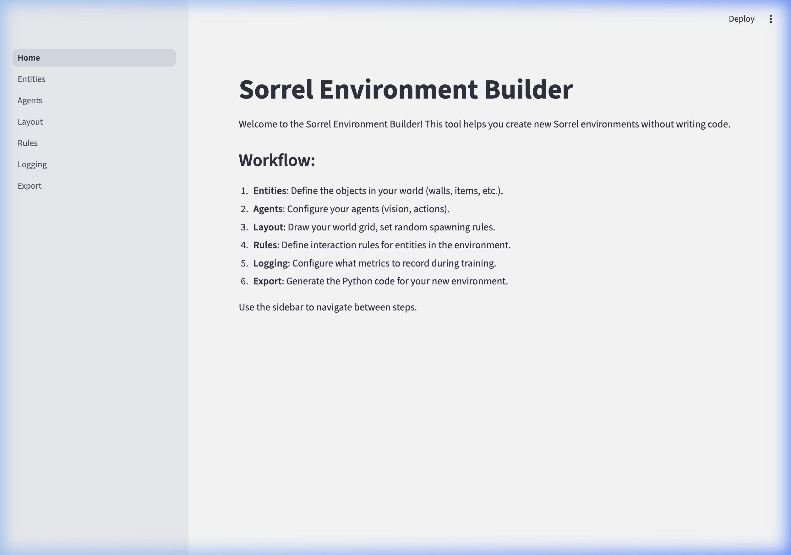
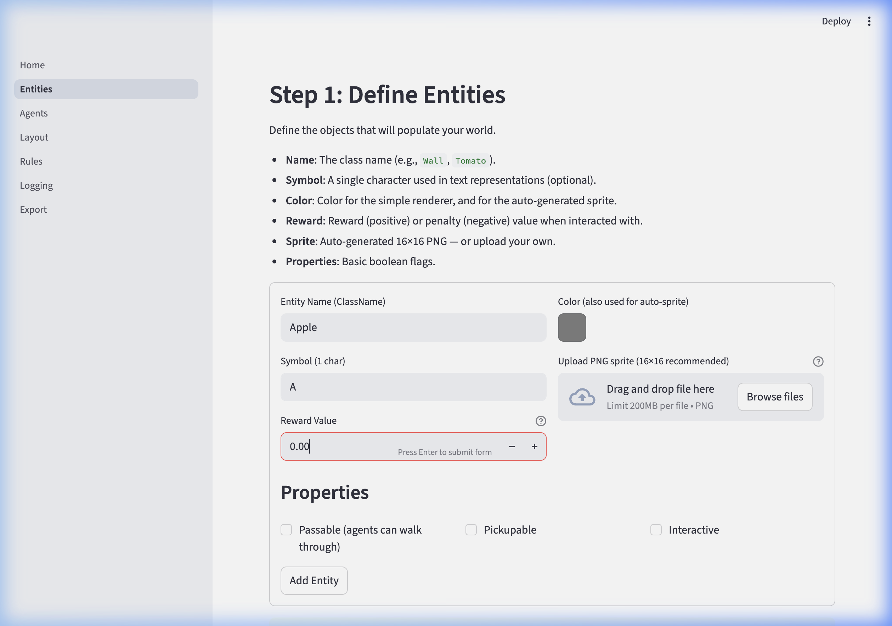
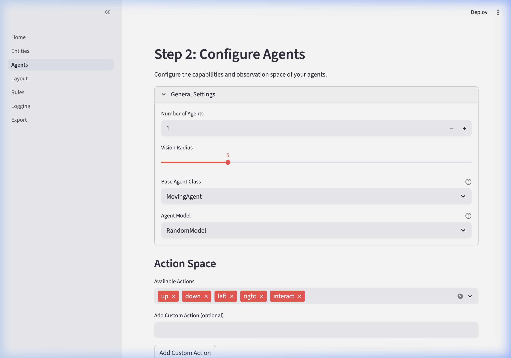
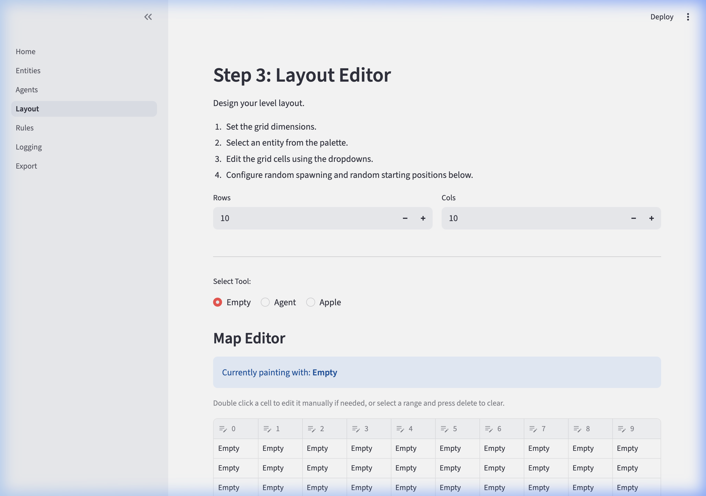
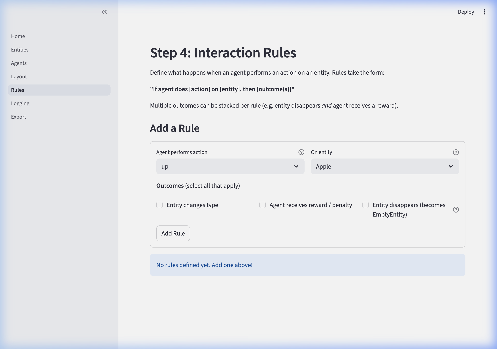
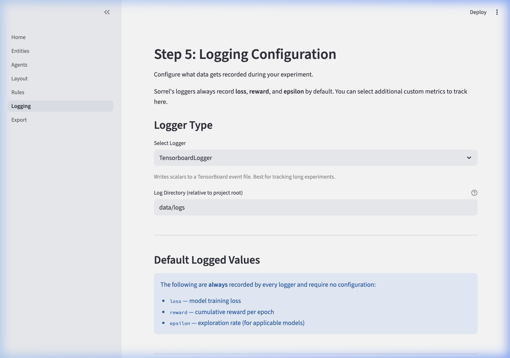
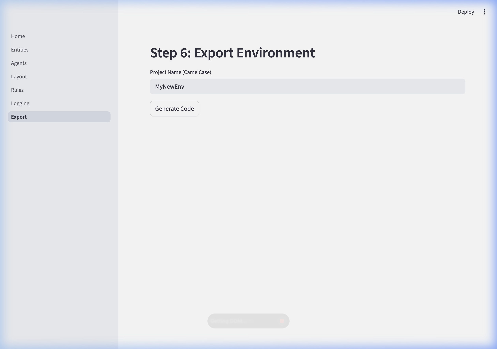

# Building Environments with the Sorrel GUI Builder

The Sorrel GUI Builder is a graphical tool that allows you to easily design and generate Sorrel environments. Instead of manually writing code to create grid layouts, define entities, and specify interaction rules, you can use an interactive browser-based interface. Once you finish designing, the GUI builder generates the underlying Python code and configuration files for your environment.

## Launching the GUI Builder

To launch the GUI Builder, open your terminal and run the following command using the Sorrel CLI:

```bash
sorrel gui
```

This command starts a local Streamlit server and automatically opens the GUI Builder in your default web browser (typically at `http://localhost:8501`).



## The Environment Creation Workflow

The GUI Builder organizes the environment creation process into 6 sequential steps, which you navigate using the sidebar.

### Step 1: Define Entities
Entities are the objects, resources, and obstacles that populate your environment (e.g., walls, apples, goals). In this step, you can configure their:
* **Appearance**: Choose a symbol representation and a display color.
* **Reward Value**: Assign numerical rewards or penalties when agents interact with the entity.
* **Physical Properties**: Determine if the entity is passable, pickupable, or interactable.



### Step 2: Configure Agents
This step focuses on the agents that will navigate your world. You can customize:
* **General Settings**: Number of agents, vision radius, and the base agent model.
* **Action Space**: Toggle standard actions (up, down, left, right, interact) or define custom actions for your specific environment.



### Step 3: Layout Editor
The Layout Editor is where you physically construct the world. You specify the grid dimensions (Rows and Columns) and use a visual map editor to "paint" your defined entities onto the grid cells.



### Step 4: Interaction Rules
Rules determine the logic of interactions between agents and entities. The interface allows you to construct rules structurally: "If **[agent]** performs **[action]** on **[entity]**, then **[outcome]**." Outcomes can range from an entity disappearing or transforming to the agent gaining or losing rewards.



### Step 5: Logging Configuration
Configure how data from the environment will be tracked during your experiments. You can select different logger formats (e.g., `TensorboardLogger`) and choose specific metrics to record, such as agent rewards, losses, or exploration rates.



### Step 6: Export Environment
Once your environment is fully designed, you provide a CamelCase **Project Name** and click **Generate Code**. The Sorrel GUI Builder will automatically compile your configuration and export the ready-to-use Python environment files into your project.



Then, you can either download the project as a Zip file or install it directly into the `sorrel/examples/` folder so that you can run it using the typical syntax for the Sorrel CLI:

```bash
sorrel run mynewenv
```
