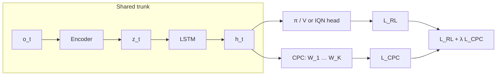
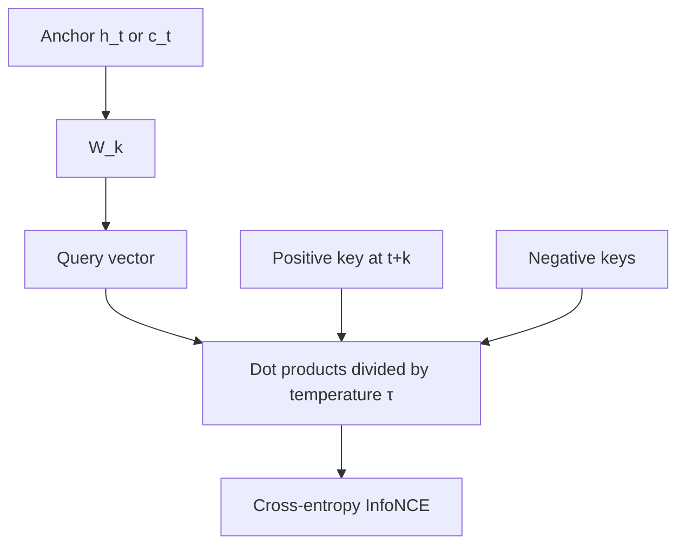

# CPC module: setup, structure, and tradeoffs

This document describes how **Contrastive Predictive Coding (CPC)** is set up in this repository: which files implement it, how it plugs into recurrent PPO and IQN, which tensors play the role of **positive vs negative samples** in the contrastive loss, and practical tradeoffs.

---

## 1. Purpose

CPC is used as an **auxiliary representation-learning objective** alongside RL. The shared encoder and LSTM are trained jointly so that a context vector at time \(t\) is encouraged to **match future representations** at \(t{+}k\) (multiple horizons \(k\)), using an **InfoNCE**-style contrastive loss.

In the **state punishment** example, CPC is optional for:

- **`ppo_lstm_cpc`** — `RecurrentPPOLSTMCPC` (`recurrent_ppo_lstm_cpc.py`)
- **`iqn` with `--iqn_use_cpc`** — `RecurrentIQNModelCPC` (`recurrent_iqn_lstm_cpc_fixed.py`)

Both follow a **CURL-style** pattern: one optimizer, one backward, combined loss  
\(L = L_{\text{RL}} + \lambda \, L_{\text{CPC}}\).

---

## 2. Code layout

| Piece | Role |
|--------|------|
| [`cpc_module_minimal.py`](cpc_module_minimal.py) | **`CPCMinimal`**: per-horizon linear predictors \(W_k: D_c \to D_z\); optional `compute_loss()` with **in-batch** negatives; `create_pair_mask_from_dones()` for episode-safe masks. |
| [`cpc_module.py`](cpc_module.py) | **`CPCModule`**: single projection on context + optional latent projection; `compute_loss()` with **batch-only** negatives (paper-style; **batch size 1 ⇒ loss 0**). |
| [`recurrent_ppo_lstm_cpc.py`](recurrent_ppo_lstm_cpc.py) | PPO + LSTM agent; imports `CPCMinimal as CPCModule` but trains CPC via **custom** `_compute_cpc_loss()` (temporal negatives). |
| [`recurrent_iqn_lstm_cpc_fixed.py`](recurrent_iqn_lstm_cpc_fixed.py) | Recurrent IQN + LSTM; same pattern: `CPCMinimal` + custom `_compute_cpc_loss()` with temporal negatives. |
| [`examples/state_punishment/env.py`](../../examples/state_punishment/env.py) | Instantiates the above models from `config` / CLI. |
| [`examples/state_punishment/config.py`](../../examples/state_punishment/config.py) | Default hyperparameters and experiment metadata for CPC. |
| [`examples/state_punishment/main.py`](../../examples/state_punishment/main.py) | CLI flags: `--use_cpc`, `--cpc_*` for PPO; `--iqn_use_cpc`, `--iqn_cpc_*` for IQN. |

**Other (not the primary state_punishment path):** `iqn_cpc.py`, `iqn_cpc_refactored.py`, `recurrent_ppo_lstm_cpc_refactored_.py`, and `deprecated/` variants may use **memory banks** and/or **`CPCModule.compute_loss`** with multi-sequence batches — different assumptions than the minimal + temporal-negative stack above.

---

## 3. Module structure (`CPCMinimal`)

- **Parameters:** `c_dim`, `z_dim`, `cpc_horizon`, `temperature`, `normalize`.
- **Weights:** `ModuleList` of `cpc_horizon` linear layers `W_k`, each mapping context at \(t\) to a vector comparable to the target at \(t{+}k\).
- **Optional API:** `compute_loss(z_seq, c_seq, mask)` — InfoNCE with negatives = **other batch indices** at the same \((t,k)\). Requires **batch size ≥ 2**; otherwise returns zero loss.
- **Masking:** `create_pair_mask_from_dones()` builds a `(B, T, K)` mask so pairs do not cross episode boundaries.

The **CURL-style agents** in this repo mostly use the **`W_k` heads** directly inside `_compute_cpc_loss()` and **do not** call `CPCMinimal.compute_loss()` during training.

---

## 4. How training actually works (CURL-style agents)

### 4.1 What is predicted?

For both PPO-CPC and IQN-CPC, the auxiliary task predicts **future LSTM outputs** \(h_{t+k}\) from the LSTM output \(h_t\) (same hidden size for context and target). The `CPCMinimal` instance is therefore constructed with `c_dim = z_dim = hidden_size`.

### 4.2 Contrastive term (where positives / negatives come from)

`_compute_cpc_loss()` in the CURL-style agents builds one InfoNCE-style term per valid horizon \(k\): a **query** \(W_k(h_t)\) should score highest against the **positive** future embedding \(h_{t+k}\), and lower against **negatives**. The exact tensors used as positive and negative keys are spelled out in **§6** and **§7**.

This **temporal-negative** recipe avoids the **batch size = 1 ⇒ no negatives** issue of pure in-batch CPC, at the cost of negatives being **correlated** with the positive (same trajectory).

### 4.3 PPO-specific details (`RecurrentPPOLSTMCPC`)

- CPC is added to the loss only on **inner PPO epoch 0** (`epoch == 0` of `K_epochs`); later epochs optimize PPO only.
- `normalize=False` for `CPCMinimal` in this agent (raw dot products, still scaled by `temperature`).
- **No memory bank:** CPC uses the **current rollout** trajectory only; `cpc_memory_bank_size` / `cpc_sample_size` in config are documented as **ignored** for this standalone model.
- **Note:** The PPO actor/critic path uses a **batched** LSTM over the full rollout, while CPC uses a **separate step-by-step** recompute with hidden-state resets on done. The two forwards are not identical implementations of the same pass (worth knowing when debugging representation drift).

### 4.4 IQN-specific details (`RecurrentIQNModelCPC`)

- CPC is combined with the IQN loss on **each** `train_step` when enabled and `current_epoch >= cpc_start_epoch`.
- `normalize=True` for `CPCMinimal` here.
- Uses the **most recent episode** from the sequence buffer (trimmed by `cpc_max_sequence_length`).
- CLI/config `iqn_cpc_sample_size` is **kept for compatibility** but **ignored** by this model (see `main.py` help text).

---

## 5. Enabling CPC in `state_punishment`

**PPO with CPC**

- `--model_type ppo_lstm_cpc` (config forces `use_cpc` true for this type).
- Tune: `--cpc_horizon`, `--cpc_weight`, `--cpc_temperature`, `--cpc_start_epoch`, etc.

**IQN with CPC**

- `--model_type iqn --iqn_use_cpc`
- Tune: `--iqn_cpc_horizon`, `--iqn_cpc_weight`, `--iqn_cpc_temperature`, `--iqn_cpc_start_epoch`. Max sequence length for CPC is `iqn_cpc_max_sequence_length` in the model config (default **500** in `env.py`; not exposed as a `main.py` flag unless you extend it).

**Example launcher:** [`examples/state_punishment/run_cpc_tmux.sh`](../../examples/state_punishment/run_cpc_tmux.sh) starts four tmux sessions comparing CPC weight 0 vs 0.1 for PPO and IQN.

---

## 6. Positive training samples (contrastive)

In InfoNCE / CPC, the **positive** is the **correct future** the context should predict.

**Shared definition across horizons**

- Fix an anchor time \(t\) and a horizon \(k \in \{1,\ldots,K\}\).
- **Query:** \(W_k(h_t)\) — linear map applied to the LSTM output at \(t\) (possibly L2-normalized when `normalize=True`).
- **Positive key:** the embedding of the **actual** state at \(t{+}k\) from the **same** episode segment: \(h_{t+k}\) (same normalization as other keys in that forward).

**CURL-style PPO / IQN (`_compute_cpc_loss`)**

- One **positive sample** per \((t,k)\) term: the vector \(h_{t+k}\) (after optional `F.normalize`).
- Cross-entropy is over logits `[sim(query, positive), sim(query, neg_1), …]` with **label 0** → the positive is always index 0 in that list.

**`CPCMinimal.compute_loss` (in-batch path, if you use it)**

- For batch element \(b\), at offset \(t\) and horizon \(k\), the positive key is **\(z_{t+k}\) from the same sequence** \(b\) (paired with anchor context \(c_t\) from sequence \(b\)).

**`CPCModule.compute_loss` in `cpc_module.py`**

- For sequence \(b\) at time \(t\) and step-ahead \(k\), the positive is **that sequence’s** future latent \(z_{t+k}\) (after `latent_proj`), matched against anchor from **that sequence’s** projected belief \(c_t\).

Invalid \((t,k)\) pairs that cross a **done** boundary are dropped (PPO/IQN: episode-id check; `CPCMinimal`: pair or timestep mask).

---

## 7. Negative training samples (contrastive)

**Negatives** are **wrong keys** the query must score lower than the positive. Which tensors are “wrong” depends on the code path.

### 7.1 Temporal negatives — `RecurrentPPOLSTMCPC` / `RecurrentIQNModelCPC`

For a chosen anchor \(t\) and horizon \(k\) (positive at index \(t{+}k\)):

- **Negative keys:** \(h_j\) for **all** timesteps \(j\) in the same sequence **except** \(j=t\) (anchor index) and **except** \(j=t{+}k\) (positive index).
- So negatives are **other time steps** in the **same** rollout: past, future, and “wrong” horizons relative to this \(k\), as long as they remain in the tensor after masking.

They are **not** drawn from a separate dataset or replay pool in this path; they are **in-trajectory, cross-time** negatives.

### 7.2 In-batch negatives — `CPCMinimal.compute_loss`

For each \((b, t, k)\):

- **Negative keys:** \(z_{t+k}\) from **other** batch indices \(b' \neq b\) at the **same** within-sequence offset \(t{+}k\) (aligned sequences).
- If **batch size \(B=1\)**, there is **no** negative; the implementation returns **zero** loss (no contrast).

### 7.3 In-batch negatives — `CPCModule.compute_loss` (`cpc_module.py`)

For anchor from sequence \(b\) at time \(t\), logits are **\(b\) vs all sequences** at the matching future index (matrix multiply across batch). The **positive** is the diagonal; **off-diagonal** sequences at that future time are the negatives.

Same **\(B=1\)** behavior: no off-diagonal negatives → loss is degenerate / zero in the intended sense.

---

## 8. Design tradeoffs (brief)

1. **Temporal vs batch negatives** — Default agents use **temporal** negatives so CPC runs with a **single** trajectory; batch-only CPC is closer to the audio/paper setup but needs **\(B \ge 2\)** aligned sequences.
2. **PPO** — CPC is only in the loss on **inner epoch 0**; **IQN** mixes CPC every `train_step` when enabled.
3. **Variance** — Random anchor \(t\) each time gives a **noisy** CPC estimate vs summing over all valid \((t,k)\).
4. **Engineering** — Multiple CPC files and legacy flags exist; confirm **which loss** your run uses. Large **`cpc_weight`** can **hurt** RL if representations are pulled away from task-relevant features.

---

## 9. Schematic: CPC structure

### 9.1 Where CPC sits in the agent (shared trunk + joint loss)

Encoder and LSTM are **shared**; RL and CPC both read LSTM outputs `h_t`. Total training loss is \(L_{\text{RL}} + \lambda L_{\text{CPC}}\).



### 9.2 Inside CPC (`CPCMinimal`): one horizon \(k\)

For each valid step-ahead \(k\), a **dedicated linear map** \(W_k\) turns the anchor context into a **query** that is matched (dot product, optional L2 norm, temperature scaling) against a **positive key** and many **negative keys**.

**CURL-style agents (temporal negatives)** — positive = \(h_{t+k}\); negatives = \(\{h_j \mid j \neq t,\; j \neq t{+}k\}\) along the same sequence.

```text
  …  o_{t-1}   o_t     o_{t+1}  …  o_{t+k}  …  o_T
              │                ╲
              ▼                 ╲  (same LSTM rollout, episode-safe)
             h_t                h_{t+k}  ← positive key
              │
              ▼
           W_k (Linear: D → D)
              │
              ▼
           query = W_k(h_t)  ─────┬── dot / (τ) ──► logits [ pos | neg_1 … neg_N ]
                                 │
     negatives: h_j for all j ∉ {t, t+k} ────────┘

  L_CPC  +=  CE(logits, label=0)   (InfoNCE-style classification: pick the positive slot)
```

**`CPCMinimal.compute_loss` (in-batch negatives)** — same \(W_k\) and query from \(c_t\), but negative keys are \(z_{t+k}\) from **other batch rows** at the same time index (see §7.2).



### 9.3 `cpc_module.py` variant (single projection + batch negatives)

`CPCModule` uses one linear **`cpc_proj`** on the belief sequence and optional **`latent_proj`** on targets; contrast is still InfoNCE, but negatives are **other sequences in the batch** at the aligned future index (§7.3), not the per-horizon \(W_k\) stack above.

---

For **older** treasure hunt experiments and more batch-negative CPC discussion, see [`examples/treasurehunt/cpc_report/`](../../examples/treasurehunt/cpc_report/) (e.g. `CPC_LEARNING_EXPLANATION.md`, `CPC_IMPLEMENTATION_EVALUATION.md`).
